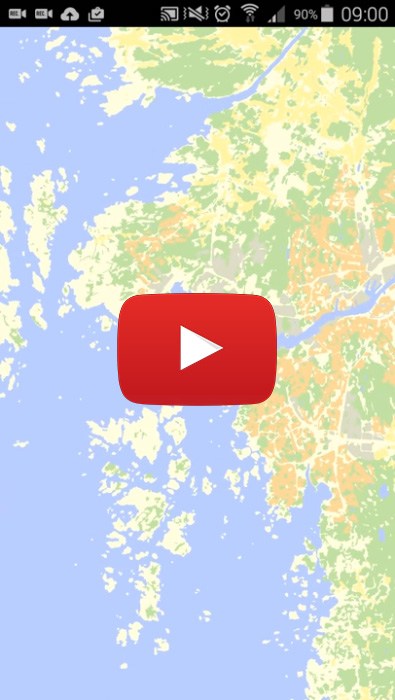

# Vectormap

OpenGL vector-based Android map (proof-of-concept)

 

Experimenting with Android, OpenGL and mapping. Features:

- Flawless pinch-zoom and pan in full 60 FPS (on a 2014 Samsung Galaxy S5)
- Predictive caching to asynchronously prefetch vector tiles that are likely to be used soon,
for example if the user zooms or pans (see `TileCache.java`)
- Smooth blending between tiles, depending on zoom level and currently loaded tiles
- Highly compressed vector tile data, using adaptive integer compression and triangle strips / fans
 (see `TileLoader.java`)
- Text rendering (not included in video above)
- Compatible with Shapefile input data; a separate project (not included in this repo) then creates the
vector tiles by incremental topology reduction and triangulation (some third party tools used in this process)

Note that this app is just a proof-of-concept and was written to learn OpenGL on Android.
A lot of work would be required to turn this into a useful mapping app.

Also note that some OpenGL helper code, and the contents of the `gles` folder, are not written by me.
